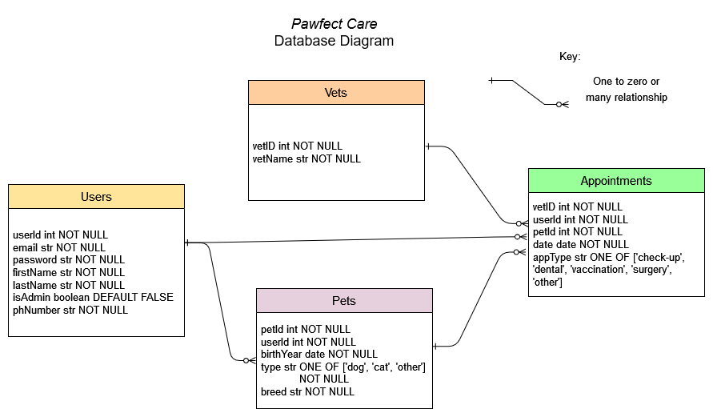
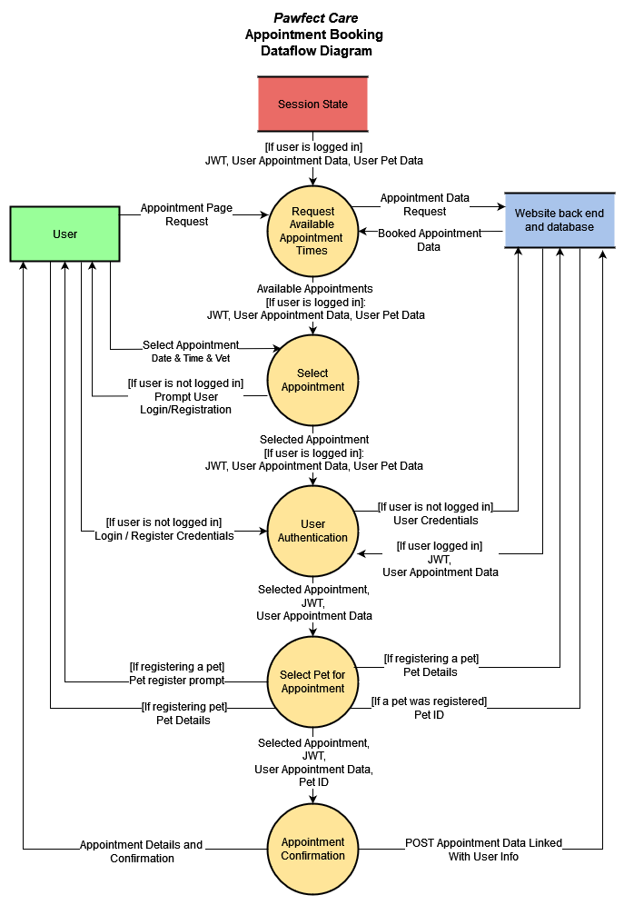
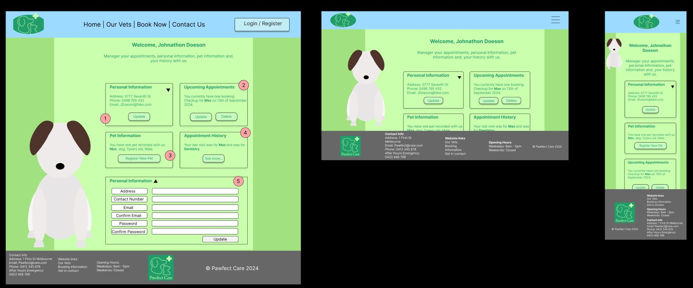

# T3A2-A

Documentation by Michael Sheppard and Tom Tutone

## R1 Description of your website, including

- Purpose
- Functionality / features
- Target audience
- Tech stack

**Business:**

A hypothetical Melbourne veterinary clinic, _Pawfect Care_.

**Purpose:**

_Pawfect Care_ is a family-run business that wants to create a website to advertise its services and allow booking appointments online. The website will allow users to create an account, register their pets and select bookings from available appointment times. With their account, users can reschedule future appointments and view their complete history of appointments. The clinic's admin users can use the website's interface to search users, appointments and pets to help manage the business.

**Functionality/Features:**

- User registration linking contact information, pet info and upcoming appointments and past appointments
- Appointment booking using an interactive calendar page that links and records an appointment date, time, pet and vet
- A contact page with the ability to send a message to the clinic's email account
- Admin functionality and the ability to access appointment data and search user information and pet data
- A home page featuring clinic news such as seasonal promotions
- An “Our Team” page promoting the clinic's staff members

**Target Audience:**

The website is built for the clinic’s clients who will transition their appointment management from in-person/phone calls to an online account system. The website is also built for new customers who find the website from a web search or recommendation. For this reason, the website will clearly offer ways to engage with the business.

The website will be built for users with low-moderate tech skills, so it is easily accessible and usable. The website will also be available on desktops and mobile devices with responsive design for each.

**Tech Stack:**

The website will be built using the MERN stack (MongoDB, Express, React, Node.js) and will leverage Mongoose schemas and validation. In addition testing will be developed using Vitest and Jest.

## R2 Dataflow Diagram /6

The _Pawfect Care_ website is built upon a database that records User instances, which describe registered accounts, Pets, which are registered by users and detail individual pets, Vets, one of which must be linked to each booking and Appointments which combine all entities as well as an appointment type.

This diagram displays the different entities recorded in the database:

A User account has a one to many relationship with Pets and Appointments. Both Pets and Vets have a one to many relationship with Appointments. This database structure allows for easy querying and populating.

The database is configured with an API which serves instance data according to the following endpoints:

These endpoints allow for complete CRUD functionality for the database's different entities.

### Dataflow

There are a variety of processes that require data to be passed between website users, their session state and the website's database.

The following dataflow diagrams adhere to Yourdon & Demarco's dataflow diagram notation conventions:

#### Context Dataflow Diagram

The application's data-driven processes are described broadly in the following diagram:

The user is an external entity which inputs data to manipulate the different site processes such as searching or logging in. The user's account, including registered appointments and pets, as well as their JWT are stored in a global session state that is provided to neccessary website functions. Storing this data rather than relying on queries speeds up the site's performance. Finally, the website's back end consists of an API and connected database which records data long term and returns it upon neccessary requests such as populating the available appointment choices.

#### User Account Dataflow Processes

Within the app, a user can register for an account, login for validation, alter appointments and see appointment history and update their contact information as well. The dataflow for these processes can be represented like so:

#### Appointment Booking Dataflow

Otherwise, the key function of the application is a user's ability to book appointments. This diagram describes the dataflow for the booking process:

First, the user makes a request for the available appointment data which is retrieved from the database. The available appointments are presented to the user based on which times are not yet recorded in the database and the user chooses an appointment from these options. Because a user can engage the booking process with or without being logged in, the data transferred between steps can vary, but ultimately, the user must be logged in to finalise the process and link one of their registered pets to the appointment. Once the appointment object is completely filled in with the user's ID, a vet ID, a pet ID, an appointment type and the date and time, it is sent to the database to be recorded. Confirmation from the database is then forwarded to the user if the recording is successful.

#### Appointment Update Dataflow

Updating an appointment is a similar process to creating a new appointment but, because the user must inherently be logged in, their appointment data and ID are carried through update steps:

Essentially, updating an appointment is very similar to scheduling one, however, at the final step, the new appointment is saved and the old appointment is deleted from the database at the same time.

#### Admin Search Dataflow

Within the app, admin accounts can access an endpoint to search for different instance data including Users, Pets and Appointments. The dataflow for this process is simply described as such:

## R3 Application Architecture Diagram /6

The website's architecture can be broken down into the front end, back end and data layers which will be created using the MERN stack (MongoDB, Express, React and Node.js). The front end will utilise a React framework using Vite for bundling. The back end will utilise an Express framework and Mongoose schemas for formatting and handling requests to the data layer and to deliver retrieved data to the front end. The back end will be executed within a Node.js environment. Centrally, the database will be NoSQL formatted and hosted using MongoDB's cloud service.

The front end technologies work together to generate an interactive webpage. React leverages HTML, CSS and JavaScript to deliver database and static webpage information, such as headings and some paragraphs, as dynamic webpages which can track state through refreshes and URL changes.

The back end will be programmed using Express.js, a server framework which is written in JavaScript. Node.js will provide used as the back end's runtime environment which will be hosted on a cloud server and execute the Express scripts. Within the back end layer, Mongoose schemas and models will be used to represent and handle data structures that are recorded in the database.

Finally, the data layer for the website will be a MongoDB database hosted on Atlas' MongoDB cloud servers.

The following application architecture diagram explains this succinctly:

## R4 User Stories /6

### Initial User Stories

When designing the _Pawfect Care_ website, it is vital that we cater to the business' varying user demographics. Notably, because a veterinary clinic has clients from diverse backgrounds, it is important to account for different levels of technology literacy.

The following are the initial user stories which directed _Pawfect Care's_ website design:

- As a user, I want an easy way for me to check and book appointments for the health of my pet.
- As a user, I want ease of information about how to contact a vet.
- As a user, I want to be able to see news about pet health
- As a user, I want to be able to see the services available to me at the vet.
- As a user, I want to be able to register my information without having to talk to somebody.

### Refined User Stories

After progressing the website's development and discussing how to best cater to these requirements, the user stories were refined and summarised.

1. Mary is a 60 year-old dog owner who has been a client of Pawfect Care for 8 years. She has typically booked her appointments by phoning the clinic but finds it difficult to conceptualise the free appointment slots described to her over the phone. She wants to use the clinic’s website to see available appointment times clearly and register her pet for check-ups without phoning in.

    _As a loyal Pawfect Care customer, I want to be able to book appointments online with my choices clearly displayed so that I do not have to call in and deal with miscommunication._

2. Dave is a 25 year-old cat owner who has just moved to Melbourne and is looking for a vet. He sees the _Pawfect Care_ clinic on his drive to work and wants to find out about the clinic’s services to gauge if he should book in his beloved pet for an appointment.

    _As a potential customer, I want to read about Pawfect Care's services and vets online so that I can decide if I should book an appointment._

3. Kyle is a 36 year-old dogsitting for his friend. He returned home to find the dog he is looking after distressed, with a rash on its paw and he wants to get it checked at the local vet as soon as possible.

    _As a user with no patient history, I want to be able to easily book a check-up for my pet as soon as possible so that I can get piece of mind quickly._

4. Miriam is a 29 year-old cat owner who has recently begun using Pawfect Care’s services. She wants access to her upcoming and past appointment data without having to manually copy it down.

    _As a user, I want to access my pet's my upcoming and past appointment data, as it exists in the clinic's database, so that I can track my pet's check-up history easily._

5. Bruce is a 45 year-old and _Pawfect Care's_ "computer expert". He wants to be able to monitor the site's bookings and user data and distribute this information to the staff easily.

    _As an admin user, I want to be able to query the appointment database easily so that I can help answer client booking questions and track the day-to-day schedule of the clinic._

6. Janette is a 22 year-old lizard owner who wants to change vets to a closer clinic. She wants to audition multiple clinics, including _Pawfect Care_, to see if they have vets who can cater for her unique pet.

    _As a potential client, I want to be able to contact the clinic and inquire about services via message so that I can ask questions without speaking on the phone._

7. Noel is a 58 year-old client of _Pawfect Care_ who is worried that the transition to an online booking system will be frustrating. He wants assurance that he can update his appointments and login credentials easily.

    _As a Pawfect Care client, I want to be able to update appointments and change account details without navigating complex menus so that I don't feel ripped off by online customer service._

These scenarios describe a lot of common use cases for the _Pawfect Care_ website and helped guide the website design process to include all neccessary features.

## R5 Wireframes for multiple standard screen sizes, created using industry standard software /6

_Pawfect Care's_ website will feature various front end routes as described by this diagram:

The routes listed explain the different functionality of each page and the different URLs a user will follow to access them.

### Menus

(From left to right)

#### Navbar

1. Logo - on click, links to the home page
2. Navbar links - links that direct the user to the website's various endpoints
3. Login/Register button - redirects the user to the Login/Register page

#### Footer

1. Clinic information - contact info/operational hours
2. Webpage links - links that direct the user to the website's various endpoints
3. Copyright information - additional legal information

#### Desktop Menu Overlay

1. Login/Register button - redirects the user to the Login/Register page
2. Menu buttons - buttons to direct the user around the website clearly

### Home

#### Home Page Features

1. News panel (slider nav) - cycles through clinic and industry news
2. Service buttons - controls which service's information is displayed in the service information panel
3. Service information panel - provides information about the selected clinic service

### Our Team

#### Our Team Page Features

1. Staff portrait - an image of a clinic staff member
2. Staff bio - a description of the staff member's work history

### Contact Us

#### Contact Us Page Features

1. Contact information - displays the clinic's address and contact information
2. Contact form - a form that allows users to enter contact information and a message that will be emailed to the clinic's email using Formspree

### Forgot Password

#### Forgot Password Page Features

1. Email input - Input for user to enter their email
2. Confirmation code input - Input for user to enter an emailed verification code
3. New password inputs - Two inputs for users to enter a new password, passwords must match for the update to work

### Login/Register

#### Login/Register Page Features

1. Credentials inputs - inputs for users to input their email and password for validation
2. Register Account form - an input for users to register and create an account. Dropdown arrow expands the form fully which is minimised closed by default

### My Account

#### My Account Page Features

1. Personal Information widget - a panel that displays a user's account information including address, phone number and email. When the "Update" button is clicked, the form section at the bottom of the page expands with inputs for updating account information
2. Upcoming Appointments widget - a panel that displays upcoming appointments registered to the user including dates, times and animal names. When the "Update" button is clicked, the user is redirected to the Book Now page and begins the appointment booking process again. When they complete the process, their old appointment is removed from the database. When the "Delete" button is clicked, a pop-up is opened prompting the user to confirm the deletion
3. Pet Information widget - a panel that displays all registered pets and allows a user to register a new pet. When "Register New Pet" is clicked, controls open at the bottom of the page to input a new pet's details, update a pet's information or delete a registered pet
4. Appointment History widget - a panel that displays the most recent appointment instance. When "See More" is clicked, a panel will open below that shows a complete history of the user's registered appointments
5. Drop down widget - a panel that displays inputs depending on which widget control is selected

### Bookings

#### Bookings Page Features

1. Account information section / register prompt - displays a link to the Login/Registration page if a user is not currently signed in. If a user is signed in, section displays the user's name
2. Select pet drop-down menu - displays all pets registered to the user's account and the option to register a new pet
3. Select appointment drop-down menu - displays a list of appointment types to choose from
4. Select vet drop-down menu - displays a list of vets to choose from for a booking. The available appointment buttons changes based on which vet selected
5. Date and time selectors - buttons that allow a user to select a day for the appointment which change the available time selections. The available times can be selected to set the booking's time attribute. The "Book Now" button appears only when a user is logged in

### Admin

#### Admin Page Features

1. Search checkboxes - allows an admin to select which data type they want to search
2. Search detail inputs - inputs for a user to enter query details for a database search. The inputs change based on which checkbox is selected so that the admin can search with any information contained in an instance
3. Search results - a panel displaying returned search results

## R6 Screenshots of your Trello (or similar kanban system) board throughout the duration of the project /6

To complete the project planning and design process, we have engaged an agile project methodology and utilised a Kanban board hosted on Trello.

### [Pawfect Care Trello Board](https://trello.com/b/dlt2E3Mm/full-stack-app)

To begin the project, we first established the broad checkpoints we needed to reach to fulfill the brief. We then extrapolated on the different stages and broke them down into steps. Each morning after beginning the project, we held stand-up meetings where we discussed goals for each day, co-ordinated design decisions which impacted the front end and back end and reprioritised tasks as neccessary. The Kanban board was updated daily and continues to be so as we progress the website's implementation.

### 11/08/2024 First Trello Screenshot

The first screenshot of our Kanban board. Each card features an assigned individual and a due date.

### 14/08/2024 Second Trello Screenshot

The second screenshot of our Kanban board. Some cards were marked completed and others were expanded to include steps we initially did not identify.

### 17/08/2024 Final Trello Screenshot for Part A

The final screenshot of our Kanban board during Part A of the assignment. We updated the board to include additional cards and checkpoints neccessary for Part B.
