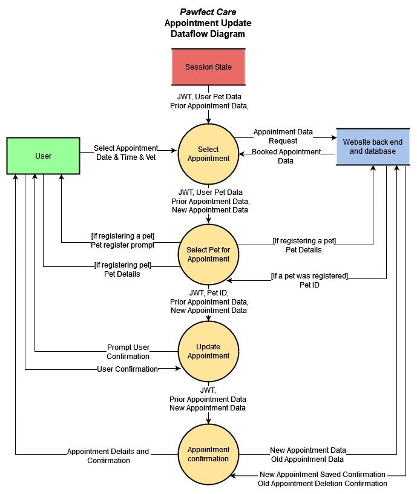

# T3A2-A

Documentation by Michael Sheppard and Tom Tutone

## R1 Description of your website, including

- Purpose
- Functionality / features
- Target audience
- Tech stack

**Business:**

A hypothetical Melbourne veterinary clinic, _Pawfect Care_.

**Purpose:**

_Pawfect Care_ is a family-run business that wants to create a website to advertise its services and allow booking appointments online. The website will allow users to create an account, register their pet and select bookings from available appointment slots. With their account, users can access an update future appointments and view their history of appointments. The clinic's admin users can user the account data to adjust appointments for clients over the phone and search patient history as well.

**Functionality/Features:**

- User registration linking contact information, pet info and upcoming appointments and past appointments
- A contact page with the ability to send a message to the clinic's email account
- Admin functionality and the ability to access booking data and search user information, appointments and pet data
- A home page featuring clinic news such as seasonal promotions
- An “about us” page describing the veterinary team
- Appointment booking, an interactive calendar page for choosing dates and making bookings

**Target Audience:**

The website is built for the clinic’s clients who will transition their appointment management from in-person/phone calls to an online account system. The website is also built for new customers who find the website from a web search or recommendation. For this reason, the website will clearly offer ways to engage with the business.

The website will be built for users with low-moderate tech skills, so it is easily accessible and usable. The website will also be available on desktops and mobile devices with responsive design for each.

**Tech Stack:**

The website will be built using the MERN stack (MongoDB, Express, React, Node.js) and will leverage Mongoose schemas and validation. In addition testing will be developed using vitest and Jest.

## R2 Dataflow Diagram /6

There are various dataflow processes that occur within the _Pawfect Care_ web application. The application connects the user, their account and database instances when interacting with Users, Appointments, Pets and Vets.

This diagram describes the different entities recorded in the database:

A User account has a one to many relationship with Pets and Appointments. Both Pets and Vets have a one to many relationship with Appointments. This database structure allows for easy querying and populating.

The database is configured with an API which serves data according to the following endpoints:

These endpoints allow for complete CRUD functionality for the database's different entities.

### Dataflow

There are a variety of processes that require data to be passed between users, session state and the database.

The following dataflow diagrams adhere to Yourdon & Demarco's notation conventions:

#### Contact Dataflow Diagram

The application's data-driven processes are described broadly in the following diagram:

The application, the user inputs data which control the processes such as searching or logging in. Data that needs to be stored between processes such as the user's authentication and registered pet data is stored and carried throughout the app in the session state. Finally, the website's backend consists of an API and connected database which records data long term and returns it upon requests.

#### User Account Dataflow Processes

Within the app, a user can register for an account, login to validate alter appointments and see appointment history and update their account as well. The various user account functionality processes data transfers like so:

#### Appointment Booking Dataflow

Elsewhere, the key function of the application is a user's ability to book appointments. This diagram describes the dataflow for the booking process:

First, the user makes a request for the available appointment data which is retrieved from the database. The available appointments are presented to the user based on which appointments are booked in the database and the user chooses an appointment from these options. Because a user can engage the booking process with or without being logged in, the data transferred between steps can vary, but ultimately, the user must be logged in so that they can link one of their registered pets (or yet to be registered pets) to the appointment. Once the appointment object is completely filled in with the user's ID, a vet ID, a pet ID and the date and time, it is sent to the database to be recorded. Confirmation from the database is forwarded to the user.

#### Appointment Update Dataflow

Updating an appointment is a similar process to creating a new appointment only, because the user must inherently be logged in, their appointment data and ID are carried through update steps:

Essentially, updating an appointment is very similar to scheduling one, however, at the final step, the new appointment is saved and the old appointment is deleted at the same time.

#### Admin Search Dataflow

Within the app, admin accounts can access and endpoint to search for different instance data including Users, Pets and Appointments. The dataflow for this process is simply described as such:

## R3 Application Architecture Diagram /6

The website can be broken down into the front end, back end and data layers which will be created using the MERN stack (MongoDB, Express, React and Node.js). The front end will utilise a React framework using Vite for bundling. The back end will utilise an Express framework and Mongoose schemas for handling requests to the data layer and to deliver retrieved data to the front end. The back end will be executed within a Node.js environment.  Centrally, the database will be NoSQL and hosted using MongoDB's cloud service.

## R4 User Stories /6

When designing the _Pawfect Care_ website, it is important to cater to the business' varying user demographics. Notably, because a veterinary clinic has clients from diverse backgrounds, it is important to account for different levels of technology literacy.

The following are imagined users and scenarios that impact how they interact with the website.

1. Mary is a dog owner who has been a client of Pawfect Care for 8 years. She has typically booked her appointments by phoning the clinic but finds it difficult to conceptualise the free appointment slots described to her over the phone. She wants to use the clinic’s website to see available appointment times clearly and register her pet for check-ups without phoning in.

    _As a loyal Pawfect Care customer, I want to be able to book appointments online with my choices clearly displayed so that I do not have to call in and deal with miscommunication._

2. Dave is a cat owner who has just moved to Melbourne and is looking for a vet. He sees the _Pawfect Care_ clinic on his drive to work and wants to find out about the clinic’s services to gauge if he should book in his cat for an appointment.

    _As a potential customer, I want to read about Pawfect Care's services and vets online so that I can decide if I should book an appointment._

3. Kyle is dogsitting for his friend. He returned home to find the dog he is looking after distressed, with a rash on its paw and he wants to get it checked at the local vet as soon as possible.

    _As a user with no patient history, I want to be able to easily book a check-up for my pet as soon as possible._

4. Miriam is a cat owner who has recently begun using Pawfect Care’s services. She wants to record the clinic’s contact information and wants to keep track of her upcoming and past appointments.

    _As a user, I want to be able to be able to see my upcoming and past appointment data so that I can track my pet's check-up history easily._

5. Bruce is _Pawfect Care's_ "tech guy". He wants to be able to monitor the site's bookings and lookup a user's appointment history as well.

    _As an admin user, I want to be able to query the appointment database easily so that I can answer client booking questions and track the day-to-day schedule of the clinic._

6. Janette is a lizard owner who wants to change vets to a closer clinic. She wants to contact multiple clinics to see if they have experts to cater for her beloved pet.

    _As a potential client, I want to be able to contact the clinic via a message service so that I can ask questions without speaking on the phone._

7. Noel is a client of _Pawfect Care_ who is worried that the transition to online booking will be frustrating. He want assurance he can update appointments and login credentials easily.

    _As a Pawfect Care client, I want to be able to update appointments and change account details easily so that the online service is no worse than speaking on the phone._

These scenarios describe a lot of common use cases for the _Pawfect Care_ website and help guide the design process to ensure that the website has all neccessary features.

## R5 Wireframes for multiple standard screen sizes, created using industry standard software /6

### Menus

(From left to right)

#### Navbar

1. Logo - links to the home page
2. Navbar links - directs viewer around the website
3. Login/Register button - redirects the user to the Login/Register page

#### Footer

1. Clinic information - contact info/operational hours
2. Website links - directs viewer around the website
3. Copyright information - additional legal information

#### Desktop Menu Overlay

1. Login/Register button - redirects the user to the Login/Register page
2. Menu buttons - buttons to direct the user around the website clearly

### Home

#### Home Page Features

1. News panel (slider nav) - cycles through clinic and industry news
2. Service buttons - controls service information displayed in the service information panel
3. Service information panel - provides information about the clinic's different services

### Our Team

#### Our Team Page Features

1. Staff portrait - an image of a clinic staff member
2. Staff bio - a description of the staff member's work history

### Contact Us

#### Contact Us Page Features

1. Contact information - displays the clinic's address and contact information
2. Contact form - a form that allows users to enter contact information and a message that will be emailed to the clinic's email using Formspree

### Forgot Password

#### Forgot Password Page Features

1. Email input - Input for user to enter their email
2. Confirmation code input - Input for user to enter the verification code sent to their email
3. New password inputs - Two inputs for users to enter a new password, passwords must match for update to work

### Login/Register

#### Login/Register Page Features

1. Credentials inputs - inputs for users to input their email and password for validation
2. Register Account form - an input for users to register and create an account. Dropdown arrow expands form fully.

### My Account

#### My Account Page Features

1. Personal Information widget - a panel that displays an user's account information including address, phone number and email. When "Update" is clicked, the form section at the bottom of the page appears with inputs for updating account information.
2. Upcoming Appointments widget - a panel that displays upcoming appointments registered to the user including dates, times and animal names. When "Update" is clicked, the user is redirected to the Book Now page and begin the appointment booking process again and, when they complete the process, their old appointment is removed from the database. When "Delete" is clicked, a pop-up is opened allowing the user to confirm the deletion.
3. Pet Information widget - a panel that displays all registered pets and allows a user to register a new pet. When "Register New Pet" is clicked, controls open at the bottom of the page to input a new pet's details, update a pet's information or delete a registered pet.
4. Appointment History widget - a panel that displays the most recent appointment instance. When "See More" is clicked, a panel will open below that show's a complete history of the user's registered appointments.
5. Drop down widget - a panel that displays inputs or information relevant to the active User Account widget.

### Bookings

#### Bookings Page Features

1. Account information / register prompt - displays a link to the Login/Registration page if a user is not currently signed in. If a user is signed in, displays the user's name.
2. Select pet drop-down menu - displays all pets registered to the user's account and the option to register a new pet.
3. Select appointment drop-down menu - displays a list of appointment types.
4. Select vet drop-down menu - displays a list of vets and for the appointment. Available appointments changes based on vet selected.
5. Date and time selectors - buttons that allow a user to select a day for the appointment, which changes the available time buttons, and buttons that allow a user to select a time for the appointment. The "Book Now" button appears only when a user is logged in.

### Admin

#### Admin Page Features

1. Search checkboxes - allows an admin to select which data type they want to search.
2. Search detail inputs - inputs for a user to enter query details for a database search. The inputs change based on which checkbox is selected to match the data properties.
3. Search results - a panel displaying search results.

## R6 Screenshots of your Trello (or similar kanban system) board throughout the duration of the project /6

[Kanban Board](https://trello.com/b/dlt2E3Mm/full-stack-app)
