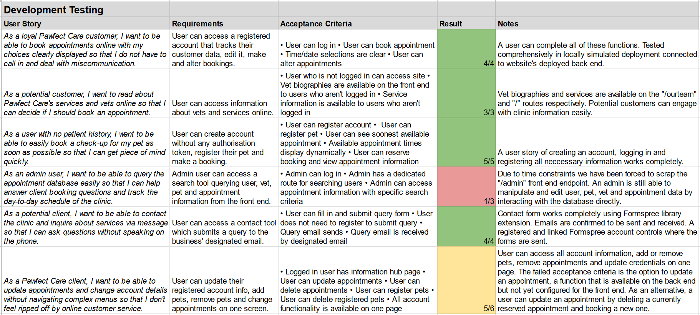
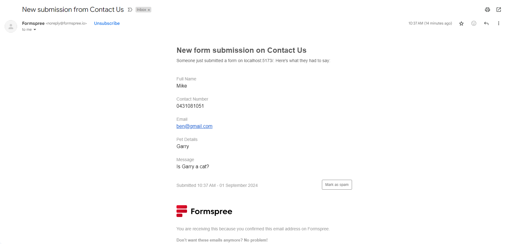
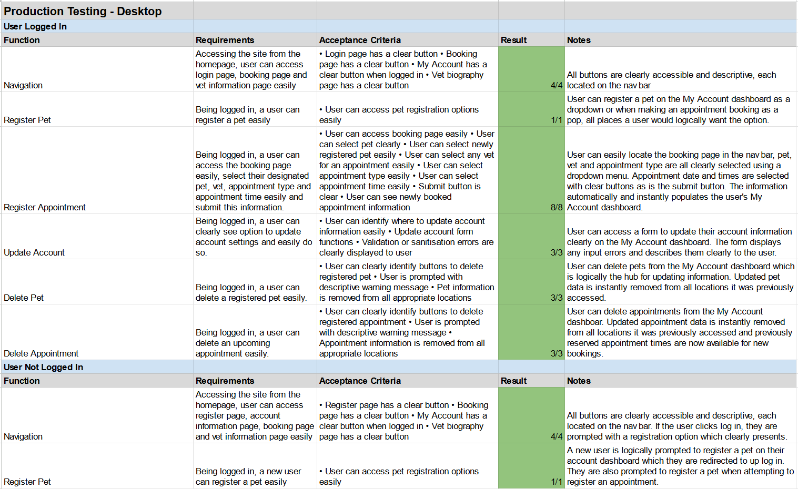

# T3A2-B Documentation

Documentation by Tom Tutone and Michael Sheppard

This README contains information relating to T3A2-B and the creation and deployment of our full stack application.

## Contents

- [Website Link](#pawfect-care-website-link)
- [Project Github Repository](#project-github-repository)
- [Project Kanban Board](#project-kanban-board)
- [Login Credentials](#login-credentials)
- [Project Libraries](#project-kanban-board)
- [Agile Project Management](#agile-project-management)
- [Trello Screenshots](#trello-screenshots)
- [Production Environment Testing](#production-environment-testing)
- [Development Environment Testing](#development-environment-testing)
- [Automated Testing](#automated-testing)
- [Project Plan Adjustments](#project-plan-adjustments)
- [T3A2-A Documentation](#t3a2-a-documentation)

## _Pawfect Care_ Website Link

[Pawfect Care Vetinary Clinic](https://pawfect-care.netlify.app/)

## Project GitHub Repository

[T3A2 MERN App Github Repository](https://github.com/tthecoder15/T3A2-MERN-App/tree/main/T3A2-B)

[_Pawfect Care_ Front End Source Code](https://github.com/tthecoder15/T3A2-MERN-App/tree/main/T3A2-B/Frontend)

[_Pawfect Care_ Back End Source Code](https://github.com/tthecoder15/T3A2-MERN-App/tree/main/T3A2-B/Backend)

## Project Kanban Board

[The Kanban board we have maintained throughout the project](https://trello.com/b/dlt2E3Mm/full-stack-app)

## Login Credentials

If you would like to test the website's functionality, feel free to register a user account or use these default accounts:

```js
const genericUser =
{
    email: "johnseesstars@gmail.com",
    password: "starrynight"
}

const adminUser = 
{
    email: "pawfectcare@gmail.com",
    password: "admin123"
}
```

These credentials will allow you to access all of the front end functionality in different user contexts. In addition, these credentials can be used to test the websites database server which is hosted at [https://pawfect-care-api.onrender.com/](https://pawfect-care-api.onrender.com/). View a diagram of the available back end endpoints [here](#t3a2-a-documentation). Feel free to submit requests to this database using Bruno or a similar HTTP request generator.

Please use this information responsibly and only seed appropriate data.

## Project Libraries - Front End

Below is a list of the libraries that were used to create the websites front end.

### vite

A front end tool which generates templates and handles the bundling of a web application in a selected language. In this project, Vite provided the infrastructure for our React project using the SWC JavaScript compiler.

### formspree/react

Handles data submission to Formspree's API which generates and sends input data, as an email, to a designated email address. Also contains error handling controls. Used to create the "Contact Us" page.

### jwt-decode

A library that decodes JWTs. Used in this project to decode JWTs returned from the site's back end to access values stored within including the "userId" and "isAdmin" values.

### react-bootstrap

A library that provides a collection of generic website elements in a React format. Used within this site to create dropdown menus.

### zustand

A state-management tool used to define global state values and functions that refresh in real-time like React's built-in "UseState" functionality. Zustand was used to store database objects and values and populate menus and interfaces as a user navigates around the website.

### zustand-persist

An add-on to Zustand which provides tools to make global state remain between refreshes and tab closures. Within this website, it saves the user's data to local storage to speed up refreshes and reduce the number of database requests neccessary.

### eslint

A tool that parses JavaScript and highlights coding and pattern errors.

### react-router-dom

A package that provides tools to handle single page application infrastructure and set up dynamic routes and hyperlinks for website navigation. Within our website, react-router-dom handles links between pages and which page is served to the user.

### vitest

Vitest is a tool used for developing unit tests within a Vite framework, including Vite React projects. Vitest was utilised for writing front end tests which describe expected results and data returns as the user navigates our website.

### react

A vital package of a React project that handles the rendering of React elements to the DOM and includes functions including ```useState``` and ```useEffect``` which track dynamic state and update the DOM as states change respectively.

## Project Libraries - Back End

Below is a list of the libraries that were used to create the website's back end.

### bcrypt

A library used to hash and obscure user passwords as they are passed to and stored in the website's database. When a user submits a login POST request, the submitted password value is hashed and compared to the saved password value of a user's account using bcrypt's functionality.

### express

express is an NPM package that provides a framework and the neccessary functions to create a web server written in JavaScript. Within our application, Express is used to handle routing requests to our database, validate and sanitise data submitted within users' HTTP requests and broadly, connect the front end of application to the cloud database.

### cors

A package that supplies Express middleware to control a server's CORs (Cross-Origin Resource Sharing) handling protocol. Within our application, the cors middleware allows users to request data from the database, via our website, without being restricted by their browser's default security measures.

### dotenv

A package that allows a JavaScript script that is executed in a runtime environment to access a .env file and its included values. dotenv is used to access a secret key used to encode JWT tokens and return them to users when they login. The back end server also accesses the MongoDB connection string which is stored in a .env file.

### express-jwt

A module that contains Express middleware to handle and interpret JWTs submitted with server requests. Within our website's back end, express-jwt is used to mandate JWTs when a user requests particular routes and handles token parsing so that they can be manipulated within Express route functions.

### jest

jest is a library that provides functions to describe and execute tests on JavaScript objects, functions and values. The jest package was combined with the supertest package to write and execute tests to confirm the back end server returned data in a predictable manner.

### supertest

A testing library which provides the functionality to simulate user's HTTP requests to a server.

### jsonwebtoken

An extension that provides the functionality to generate JWTs encoded with user data and a signature that is unique to the back end server. Within our back end, jsonwebtoken creates and returns unique JWTs which users can submit as authorisation to access various back end routes.

### mongoose

mongoose is an Object-Document Mapper (ODM) library that is used to create and describe database entity models and schemas. mongoose provides validation tools to ensure that users' requests contain appropriate fields and values. The mongoose library also provides functionality to connect a back end server to a MongoDB database. Within our application, mongoose is used to connect our back end server to a dedicated MongoDB cloud database, describe and format the entities we record in the database and return descriptive error messages when users submit incorrect database requests.

## Agile Project Management

### Stand Ups

Throughout the project we completed a series of stand up meetings and recorded them in write ups. These are our stand ups. The stand ups were vital to our project's agile methodology and identifying progress impediments.

To skip to the next part of this document, [click here.](#production-environment-testing)

### Stand Up 1 19/8/2024

**What did you get done in the last 24 hours?**

Yesterday we finalised the T3A2-A README, tweaking parts of it and making it more presentable.

We also initialised the file structure for the front end, planned out folders and files for each component and gather extra resources on how to implement them.

**What blockers/issues are you having?**

We are currently working on implementing some CSS to make created components function and implementing a carousel to display news which is proving challenging.

**What do you plan to do in the next 24 hours?**

We will work through the block of the carousel and implement and style it to fit the wireframe reference.

In addition, we will set up the back end including the database and API routing.

**What is one thing you have learned?**

We have advanced our understanding of React libraries, finding the right one for the functions we have planned, and for the project.

We have also learnt more about source control and working with branches in git.

### Stand Up 2 20/8/24

**What did you get done in the last 24 hours?**

Yesterday we added extra components and content to the SPA and fixed some source control issues:

- Added carousel and "Services" buttons to the homepage
- Added content to Our Team page.
- Added contact form to Contact us page

In addition, we setup and connected the database to the back end server. The schemas are setup and the seed function is working.

**What blockers/issues are you having?**

Yesterday we spent far too long on CSS styling and finding the minimum layout settings required.  It bottlenecked progress until we moved on to other components.

**What do you plan to do in the next 24 hours?**

We plan on working through the Trello board and adding more components to the front end. We plan to have set up and coded at least half of the planned components by the end of the day.

In regards to the back end, we will finish the routing today so that the database information is served at the appropriate endpoints.

**What is one thing you have learned?**

We have learned that it is better to move on if you get stuck and come back to a problem with a fresh mind.

### Stand Up 3 21/08/24

**What did you get done in the last 24 hours?**

Yesterday we began work on the account settings section of the front end.  A user will be able to update their personal details after they have logged in, which now comes with email and password confirmation, using proper validation.

We also advanced the backend and the routers are almost complete.

**What blockers/issues are you having?**

We are still struggling with getting the CSS to fall into place.

**What do you plan to do in the next 24 hours?**

Today we will finish the four major components on the MyAccount page and start working on our MVP - Our booking tool.

We will also finish the routing and implement login using BCrypt and JWTs.

**What is one thing you have learned?**

How to handle date objects and convert them to strings which includes local time zone information.

### Stand Up 4 22/8/24

**What did you get done in the last 24 hours?**

Yesterday we completed creating the personal information webpage.  It is now just awaiting connection to the backend and styling to be fully complete.

We also created a forgot password function that asks for email validation from the backend.

On the back end, we implemented data validation that ensures users can only link foreign values that exist in the db. We also advanced the error messaging to be more clear, implemented JWT serving and checking and finished the routing for all of the API endpoints.

**What blockers/issues are you having?**

Nothing at the moment.

**What do you plan to do in the next 24 hours?**

We plan on creating our MVP. Have it working with full functionality.

We also plan on deploying the backend and connecting all the components up to it.

The back end will also implement bcrypt for password hashing.

**What is one thing you have learned?**

How to use JWT with Express

### Stand Up 5 23/8/24

**What did you get done in the last 24 hours?**

We deployed the back end got it running without complete authorisation functionality but with many features enabled.

Setup basic functionality including some components to the booking tool.

We also started connecting the front to the back end.

**What blockers/issues are you having?**

It is a challenge to implement authorisation and error catching in Express as, unlike Flask, the built in error generators are a bit less predictable. In addition, Mongoose has less authorisation presets than marshmallow so these have to be manually crafted often.

**What do you plan to do in the next 24 hours?**

Implement more back end authorisation.

Create a global state for user authentication and fully connect deployed api to the front end.

**What is one thing you have learned?**

How to implement JWT and Bcrypt in express. It is pretty effective and simple thanks to Express' middleware.

### Stand Up 6 24/8/24

**What did you get done in the last 24 hours?**

We connected the back end to the front in for user log in and user update and troubleshooted the various difficulties it came with.

**What blockers/issues are you having?**

Presently none but we had to figure out Zustand for updating particular values and implementing our log in function in the global state.

**What do you plan to do in the next 24 hours?**

Add additional back end validation and confirm the returned data makes sense to the back end.

**What is one thing you have learned?**

How to use Zustand more effectively and how to troubleshoot and handle fetch requests.

### Stand Up 7 26/8/24

**What did you get done in the last 24 hours?**

We mostly finalised back end validation to ensure users cannot register information not linked to their own account or double up on entries.

We connected more back end information to the front end including appointment data so it can be displayed in a MyAccount dash.

We started setting up front end tests, installing Vitest and created our first test page.

**What blockers/issues are you having?**

Had to rewatch the react testing lesson to be able to set up Vitest properly.

**What do you plan to do in the next 24 hours?**

Finish the MyAccount dashboard and have it display all appropriate user data neatly.

**What is one thing you have learned?**

How to make Zustand global state persist.
How to set up Vitest tests.

### Stand-up 8 27/8/24

**What did you get done in the last 24 hours?**

We configured the front end so that users can register pets using a drop down menu on their "My Account" dashboard. This includes a pop-up that appears when the user's JWT is expired and prompts them to log in again.

Setup and started testing all components of the front end.  Each route has been tested both through their route module and through the app module. Almost all completed components have been tested.

**What blockers/issues are you having?**

The back end validation never ends. Attempting to add a pet to the DB highlighted that posts to particular routes weren't updating related DB instances so those need to be updated.

**What do you plan to do in the next 24 hours?**

Mostly finish the book appointment interface functionally.

Finish all tests for components that have been completed.  Work on account registration component.

**What is one thing you have learned?**

When running tests there a lot of unexpected things that will come up and cause errors, or even just small warnings.  We have gone back and fixed some code due to warning from tests.

### Stand Up 9 28/8/24

**What did you get done in the last 24 hours?**

We got the booking tool completed, our mvp.
We also adjusted some of the other components to be more interactive.
Finished some more front end tests.

**What blockers/issues are you having?**

Sorting out little glitchs in booking tool.
We had an issue with creating tests for fucntions that required a login.

**What do you plan to do in the next 24 hours?**

Adjustments to the booking tool, including styling.
Complete register form and make the dropdown menu closeable on button click.

**What is one thing you have learned?**

How to make a mock login state to allow tests of authenticated components.

### Stand Up 10 29/8/24

**What did you get done in the last 24 hours?**

We fixed some errors on the booking tool and prepared for the presentation.

We advanced the site's styling toward the wireframe designs.

**What blockers/issues are you having?**

Making a popup open and a dropdown menu close simultaneously. It is impossible to make React change the DOM in two ways simultaneously. We need to devise a way to work around this problem.

**What do you plan to do in the next 24 hours?**

Fix final errors on the booking tool, finish the styling for the site.

**What is one thing you have learned?**

React cannot update two states which affect the visual layout simultaneously.

### Stand Up 11 30/8/24

**What did you get done in the last 24 hours?**

Yesterday we presented our code to the class.

We also fixed some errors occuring on the booking tool including times being removed from the available time options for a year in advance from the present day due to a glitch in the feature's conditional statements.

We also finished the NavBar so that it, and the footer, are responsive to the screen's dimensions.

**What blockers/issues are you having?**

Time is becoming a challenge as we approach the project's due date. We have had to adjust our plans for some features and discuss how most effectively to use our remaining time.

**What do you plan to do in the next 24 hours?**

We plan on adding a delete button to appointments in "MyAccountDash" and completing the back end test writing.

In addition, we plan on finishing the site's base styling so that it alligns with our wireframes. At this stage, we will progress the styling to be as aesthetic as possible then, with any remaining time, polish it.

**What is one thing you have learned?**

How to use timeout functions so that two DOM elements can be changed one after the other.

### Stand Up 12 31/8/24

**What did you get done in the last 24 hours?**

Yesterday we mostly finished the back end tests. During this process, we identified errors in the PATCH endpoints for appointments where the route could not handle requests that did not provide all of the values required to POST an appointment. We also updated and finalised the /users route.

We also progressed the CSS to a great level where it is functional and aesthetic.

**What blockers/issues are you having?**

The back end tests have highlighted errors in how the /appointments endpoint is configured. For example, if an appointment is updated with a new vetId, the old vet needs to have the appointment removed. This is a challenge because the original vets ID is not included in the request body in this case. We need to devise a workaround.

**What do you plan to do in the next 24 hours?**

We plan on finishing the back end tests and the front end tests completely.

We also plan on deploying the front end to identify any errors in the project's structure.

Finally, we plan on advancing the README that we must submit to near completion.

**What is one thing you have learned?**

Additional functionality of the mongoose ```.find()``` functions. For example, using the ```$in``` and ```$pull``` condition which checks for a value in an object and deletes all matching values respectively.

## Trello Screenshots

### [Pawfect Care Trello Board](https://trello.com/b/dlt2E3Mm/full-stack-app)

Throughout this project, we employed a Kanban board created using the web application Trello. Below are the progress screenshots we captured throughout the website's creation. In addition, we distributed tasks between ourselves based on the collective difficulty of the tasks assigned. The distribution of tasks was in indicated on the Trello board by linking a user to a card.

Tom was tasked with setting up the back end before moving on to help with the front end after approximately one week and Mike was tasked with setting up the front end infrastructure, including creating all relevant inputs and handling their state changes, as well as completing the front end testing. These roles were chosen because Tom designed the back end structure during T3A2-A whilst Mike created the wireframes.

During the final three days of the project, Mike had to attend to a family emergency which severely limited his time to work on the project. This impacted our ability to create all features that we intended to implement and meant task delegation more fluid. Ultimately, however, we were able to fulfil almost all of our project goals.

#### 19/08/2024 First Trello Screenshot


The first screenshot of our Kanban board during T3A2-B.

#### 22/08/2024 Second Trello Screenshot


The second screenshot of our Kanban board during T3A2-B.

#### 25/08/2024 Third Trello Screenshot


The third screenshot of our Kanban board during T3A2-B.

#### 29/08/2024 Fourth Trello Screenshot


The fourth screenshot of our Kanban board during T3A2-B.

#### 31/08/2024 Fifth Trello Screenshot


The fifth screenshot of our Kanban board during T3A2-B.

## Development Environment Testing

Before deploying the website, we had completed extensive testing by running the web application on a local port. Below are a list of tests we completed before deploying the website.



The following screenshot shows the email received via the "Contact Us" page form created using Formspree:



## Production Environment Testing

We first deployed the front end on the 31st. After deploying the website, we executed manual tests on both a desktop and a mobile device to identify issues. Below are screenshots of issues we immediately identified.

### Desktop Testing Screenshots


When attempting to log in to a seed user's account, it became apparent that the website's back end server was not connecting correctly. In addition, it highlighted the need for an indicator that shows a back end request is processing in case it is delayed.


This screenshot of the website's homepage reveals that the website's images were incorrectly linked. We have since corrected these link paths.


This screenshot of the MyAccount page shows a 404 error that presented when a user refreshed on a page other than the website's home page. We solved this solution by creating a ```_redirect``` file that compensates for React's single-page application structure.

### Mobile Test Screenshots


This screenshot reveals what happens when a user who is not logged in attempts to access the "/MyAccount" endpoint. The page is static and uninformative and needed to be reconfigured to automatically reroute a user who accesses this page without being logged in.


This screenshot reveals that the website's booking tool is functional but is not styled as expected when loaded on mobile. We have sinced solved this by adjusting the page's CSS.


This screenshot depicts the MyAccount dashboard when viewed on mobile. Testing this endpoint reveals that the information displays correctly but also shows that the text displays with different colours. This is an aesthetic issue we have since fixed by adjusting the CSS code.

### Production Environment Test Grid

After these initial tests, we completed formalised production environment tests using both desktop and mobile devices which are described and assessed below.

Desktop testing and results:



Mobile testing and results:


Both desktop and mobile tests in a deployed environment were successful.

## Automated Testing

We also created extensive automated tests for the back end and front end to ensure functionality persisted as changes were made. Below is a screenshot of the 41 back end tests being successfully completed by Jest and their descriptions.


The back end tests can be accessed [here](https://github.com/tthecoder15/T3A2-MERN-App/blob/main/T3A2-B/Backend/tests/app.test.js).

Below is a screenshot of the 62 front end tests being successfully executed by Jest and their descriptions.


The front end tests can be accessed [here](https://github.com/tthecoder15/T3A2-MERN-App/tree/main/T3A2-B/Frontend/src/tests).

## Project Plan Adjustments

Due to time contstraints, we were forced to cut some features we intended to implement within our web application. The features we left out of the finished product are:

- /admin endpoint
  - a webpage created for admin users to manage and search user, pet and appointment information
  - the back end is configured to allow this functionality but we did not have time to implement it on the front end
  - with additional time, this is the first feature we would add
- Update booking
  - we initially intended to allow users to update their appointments rather than simply deleting them and rebooking
  - this is a minor quality of life change and non-essential
- Forgot password functionality
  - the ability to send an automated reset password email to a user
  - this is a quality of life feature we would employ with additional time

Ultimately, whilst we were disappointed to cut these features, they would be simple to implement with additional time based on the project's robust infrastructure.

[Back to top of this document](#t3a2-b-documentation)

## T3A2-A Documentation

Documentation by Michael Sheppard and Tom Tutone

### R1 Description of your website, including

- Purpose
- Functionality / features
- Target audience
- Tech stack

**Business:**

A hypothetical Melbourne veterinary clinic, _Pawfect Care_.

**Purpose:**

_Pawfect Care_ is a family-run business that wants to create a website to advertise its services and allow booking appointments online. The website will allow users to create an account, register their pets and select bookings from available appointment times. With their account, users can reschedule future appointments and view their complete history of appointments. The clinic's admin users can use the website's interface to search users, appointments and pets to help manage the business.

**Functionality/Features:**

- User registration linking contact information, pet info and upcoming appointments and past appointments
- Appointment booking using an interactive calendar page that links and records an appointment date, time, pet and vet
- A contact page with the ability to send a message to the clinic's email account
- Admin functionality and the ability to access appointment data and search user information and pet data
- A home page featuring clinic news such as seasonal promotions
- An “Our Team” page promoting the clinic's staff members

**Target Audience:**

The website is built for the clinic’s clients who will transition their appointment management from in-person/phone calls to an online account system. The website is also built for new customers who find the website from a web search or recommendation. For this reason, the website will clearly offer ways to engage with the business.

The website will be built for users with low-moderate tech skills, so it is easily accessible and usable. The website will also be available on desktops and mobile devices with responsive design for each.

**Tech Stack:**

The website will be built using the MERN stack (MongoDB, Express, React, Node.js) and will leverage Mongoose schemas and validation. In addition testing will be developed using Vitest and Jest.

### R2 Dataflow Diagram /6

The _Pawfect Care_ website is built upon a database that records User instances, which describe registered accounts, Pets, which are registered by users and detail individual pets, Vets, one of which must be linked to each booking and Appointments which combine all entities as well as an appointment type.

This diagram displays the different entities recorded in the database:


A User account has a one to many relationship with Pets and Appointments. Both Pets and Vets have a one to many relationship with Appointments. This database structure allows for easy querying and populating.

The database is configured with an API which serves instance data according to the following endpoints:

#### Database End Points


These endpoints allow for complete CRUD functionality for the database's different entities.

[Back to top of this document](#t3a2-b-documentation)

#### Dataflow

There are a variety of processes that require data to be passed between website users, their session state and the website's database.

The following dataflow diagrams adhere to Yourdon & Demarco's dataflow diagram notation conventions (Woodman, 1988):


#### Context Dataflow Diagram

The application's data-driven processes are described broadly in the following diagram:


The user is an external entity which inputs data to manipulate the different site processes such as searching or logging in. The user's account, including registered appointments and pets, as well as their JWT are stored in a global session state that is provided to neccessary website functions. Storing this data rather than relying on queries speeds up the site's performance. Finally, the website's back end consists of an API and connected database which records data long term and returns it upon neccessary requests such as populating the available appointment choices.

#### User Account Dataflow Processes

Within the app, a user can register for an account, login for validation, alter appointments and see appointment history and update their contact information as well. The dataflow for these processes can be represented like so:


#### Appointment Booking Dataflow

Otherwise, the key function of the application is a user's ability to book appointments. This diagram describes the dataflow for the booking process:


First, the user makes a request for the available appointment data which is retrieved from the database. The available appointments are presented to the user based on which times are not yet recorded in the database and the user chooses an appointment from these options. Because a user can engage the booking process with or without being logged in, the data transferred between steps can vary, but ultimately, the user must be logged in to finalise the process and link one of their registered pets to the appointment. Once the appointment object is completely filled in with the user's ID, a vet ID, a pet ID, an appointment type and the date and time, it is sent to the database to be recorded. Confirmation from the database is then forwarded to the user if the recording is successful.

#### Appointment Update Dataflow

Updating an appointment is a similar process to creating a new appointment but, because the user must inherently be logged in, their appointment data and ID are carried through update steps:


Essentially, updating an appointment is very similar to scheduling one, however, at the final step, the new appointment is saved and the old appointment is deleted from the database at the same time.

#### Admin Search Dataflow

Within the app, admin accounts can access an endpoint to search for different instance data including Users, Pets and Appointments. The dataflow for this process is simply described as such:


#### References

Woodman, M. (1988) ‘Yourdon dataflow diagrams: A tool for disciplined requirements analysis’, _Information and Software Technology_, 30(9), pp. 515-533. 10.1016/0950-5849(88)90131-0.

### R3 Application Architecture Diagram /6

The website's architecture can be broken down into the front end, back end and data layers which will be created using the MERN stack (MongoDB, Express, React and Node.js). The front end will utilise a React framework using Vite for bundling. The back end will utilise an Express framework and Mongoose schemas for formatting and handling requests to the data layer and to deliver retrieved data to the front end. The back end will be executed within a Node.js environment. Centrally, the database will be NoSQL formatted and hosted using MongoDB's cloud service.

The front end technologies work together to generate an interactive webpage. React leverages HTML, CSS and JavaScript to deliver database and static webpage information, such as headings and some paragraphs, as dynamic webpages which can track state through refreshes and URL changes.

The back end will be programmed using Express.js, a server framework which is written in JavaScript. Node.js will provide used as the back end's runtime environment which will be hosted on a cloud server and execute the Express scripts. Within the back end layer, Mongoose schemas and models will be used to represent and handle data structures that are recorded in the database.

Finally, the data layer for the website will be a MongoDB database hosted on Atlas' MongoDB cloud servers.

The following application architecture diagram explains this succinctly:


### R4 User Stories /6

#### Initial User Stories

When designing the _Pawfect Care_ website, it is vital that we cater to the business' varying user demographics. Notably, because a veterinary clinic has clients from diverse backgrounds, it is important to account for different levels of technology literacy.

The following are the initial user stories which directed _Pawfect Care's_ website design:

- As a user, I want an easy way for me to check and book appointments for the health of my pet.
- As a user, I want ease of information about how to contact a vet.
- As a user, I want to be able to see news about pet health
- As a user, I want to be able to see the services available to me at the vet.
- As a user, I want to be able to register my information without having to talk to somebody.

#### Refined User Stories

After progressing the website's development and discussing how to best cater to these requirements, the user stories were refined and summarised.

1. Mary is a 60 year-old dog owner who has been a client of Pawfect Care for 8 years. She has typically booked her appointments by phoning the clinic but finds it difficult to conceptualise the free appointment slots described to her over the phone. She wants to use the clinic’s website to see available appointment times clearly and register her pet for check-ups without phoning in.

    _As a loyal Pawfect Care customer, I want to be able to book appointments online with my choices clearly displayed so that I do not have to call in and deal with miscommunication._

2. Dave is a 25 year-old cat owner who has just moved to Melbourne and is looking for a vet. He sees the _Pawfect Care_ clinic on his drive to work and wants to find out about the clinic’s services to gauge if he should book in his beloved pet for an appointment.

    _As a potential customer, I want to read about Pawfect Care's services and vets online so that I can decide if I should book an appointment._

3. Kyle is a 36 year-old dogsitting for his friend. He returned home to find the dog he is looking after distressed, with a rash on its paw and he wants to get it checked at the local vet as soon as possible.

    _As a user with no patient history, I want to be able to easily book a check-up for my pet as soon as possible so that I can get piece of mind quickly._

4. Miriam is a 29 year-old cat owner who has recently begun using Pawfect Care’s services. She wants access to her upcoming and past appointment data without having to manually copy it down.

    _As a user, I want to access my pet's my upcoming and past appointment data, as it exists in the clinic's database, so that I can track my pet's check-up history easily._

5. Bruce is a 45 year-old and _Pawfect Care's_ "computer expert". He wants to be able to monitor the site's bookings and user data and distribute this information to the staff easily.

    _As an admin user, I want to be able to query the appointment database easily so that I can help answer client booking questions and track the day-to-day schedule of the clinic._

6. Janette is a 22 year-old lizard owner who wants to change vets to a closer clinic. She wants to audition multiple clinics, including _Pawfect Care_, to see if they have vets who can cater for her unique pet.

    _As a potential client, I want to be able to contact the clinic and inquire about services via message so that I can ask questions without speaking on the phone._

7. Noel is a 58 year-old client of _Pawfect Care_ who is worried that the transition to an online booking system will be frustrating. He wants assurance that he can update his appointments and login credentials easily.

    _As a Pawfect Care client, I want to be able to update appointments and change account details without navigating complex menus so that I don't feel ripped off by online customer service._

These scenarios describe a lot of common use cases for the _Pawfect Care_ website and helped guide the website design process to include all neccessary features.

### R5 Wireframes for multiple standard screen sizes, created using industry standard software /6

_Pawfect Care's_ website will feature various front end routes as described by this diagram:


The routes listed explain the different functionality of each page and the different URLs a user will follow to access them.

#### Menus


(From left to right)

#### Navbar

1. Logo - on click, links to the home page
2. Navbar links - links that direct the user to the website's various endpoints
3. Login/Register button - redirects the user to the Login/Register page

#### Footer

1. Clinic information - contact info/operational hours
2. Webpage links - links that direct the user to the website's various endpoints
3. Copyright information - additional legal information

#### Tablet Menu Overlay

1. Login/Register button - redirects the user to the Login/Register page
2. Menu buttons - buttons to direct the user around the website clearly

#### Home


#### Home Page Features

1. News panel (slider nav) - cycles through clinic and industry news
2. Service buttons - controls which service's information is displayed in the service information panel
3. Service information panel - provides information about the selected clinic service

#### Our Team


#### Our Team Page Features

1. Staff portrait - an image of a clinic staff member
2. Staff bio - a description of the staff member's work history

#### Contact Us


#### Contact Us Page Features

1. Contact information - displays the clinic's address and contact information
2. Contact form - a form that allows users to enter contact information and a message that will be emailed to the clinic's email using Formspree

#### Forgot Password


#### Forgot Password Page Features

1. Email input - Input for user to enter their email
2. Confirmation code input - Input for user to enter an emailed verification code
3. New password inputs - Two inputs for users to enter a new password, passwords must match for the update to work

#### Login/Register


#### Login/Register Page Features

1. Credentials inputs - inputs for users to input their email and password for validation
2. Register Account form - an input for users to register and create an account. Dropdown arrow expands the form fully which is minimised closed by default

#### My Account


#### My Account Page Features

1. Personal Information widget - a panel that displays a user's account information including address, phone number and email. When the "Update" button is clicked, the form section at the bottom of the page expands with inputs for updating account information
2. Upcoming Appointments widget - a panel that displays upcoming appointments registered to the user including dates, times and animal names. When the "Update" button is clicked, the user is redirected to the Book Now page and begins the appointment booking process again. When they complete the process, their old appointment is removed from the database. When the "Delete" button is clicked, a pop-up is opened prompting the user to confirm the deletion
3. Pet Information widget - a panel that displays all registered pets and allows a user to register a new pet. When "Register New Pet" is clicked, controls open at the bottom of the page to input a new pet's details, update a pet's information or delete a registered pet
4. Appointment History widget - a panel that displays the most recent appointment instance. When "See More" is clicked, a panel will open below that shows a complete history of the user's registered appointments
5. Drop down widget - a panel that displays inputs depending on which widget control is selected

#### Bookings


#### Bookings Page Features

1. Account information section / register prompt - displays a link to the Login/Registration page if a user is not currently signed in. If a user is signed in, section displays the user's name
2. Select pet drop-down menu - displays all pets registered to the user's account and the option to register a new pet
3. Select appointment drop-down menu - displays a list of appointment types to choose from
4. Select vet drop-down menu - displays a list of vets to choose from for a booking. The available appointment buttons changes based on which vet selected
5. Date and time selectors - buttons that allow a user to select a day for the appointment which change the available time selections. The available times can be selected to set the booking's time attribute. The "Book Now" button appears only when a user is logged in

#### Admin


#### Admin Page Features

1. Search checkboxes - allows an admin to select which data type they want to search
2. Search detail inputs - inputs for a user to enter query details for a database search. The inputs change based on which checkbox is selected so that the admin can search with any information contained in an instance
3. Search results - a panel displaying returned search results

### R6 Screenshots of your Trello (or similar kanban system) board throughout the duration of the project /6

To complete the project planning and design process, we have engaged an agile project methodology and utilised a Kanban board hosted on Trello.

#### [Pawfect Care Trello Board](https://trello.com/b/dlt2E3Mm/full-stack-app)

To begin the project, we first established the broad checkpoints we needed to reach to fulfil the brief. We then extrapolated on the different stages and broke them down into steps. Each morning after beginning the project, we held stand-up meetings where we discussed goals for each day, co-ordinated design decisions which impacted the front end and back end and reprioritised tasks as neccessary. The Kanban board was updated daily and continues to be so as we progress the website's implementation.

#### 11/08/2024 First Trello Screenshot


The first screenshot of our Kanban board. Each card features an assigned individual and a due date.

#### 14/08/2024 Second Trello Screenshot


The second screenshot of our Kanban board. Some cards were marked completed and others were expanded to include steps we initially did not identify.

#### 17/08/2024 Final Trello Screenshot for Part A


The final screenshot of our Kanban board during Part A of the assignment. We updated the board to include additional cards and checkpoints neccessary for Part B.
